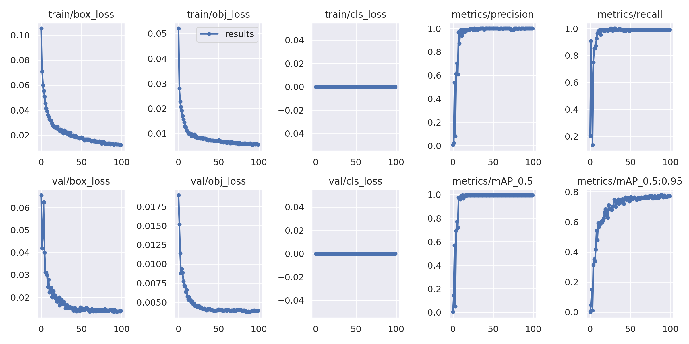

## Modelling

Bar codes object detection

### Dataset


Download the dataset from [here](https://disk.yandex.ru/d/nk-h0vv20EZvzg)

### Install

```python
pip install -r requirements.txt  # install
```

### Dataset preparing

For dataset preparing use *prepare_dataset.ipynb* from notebooks folder

### Dataset analysis

```python
pip install fiftyone
```

Ypu can explore your pascalvoc dataset with command (for more information please visit https://docs.voxel51.com/)

```python
import fiftyone as fo

name = "your_dataset_name"
data_path = "path/to/images"
labels_path = "path/to/annotations.xml"

# Import dataset by explicitly providing paths to the source media and labels
dataset = fo.Dataset.from_dir(
    dataset_type=fo.types.VOCDetectionDataset,
    data_path=data_path,
    labels_path=labels_path,
    name=name,
)

session = fo.launch_app(dataset)
```

### Training

```python
yolov5 train --img  --batch <batch-size> --epochs <epochs> --data data/barcode.yaml \
  --weights <pretrained weigths (ex: yolov5n.pt)> --device <cuda_device_id> --project <project_name> \
  --name <experiement_folder_name> > log.out
```

### Export to OpenVINO

```python
yolov5 export  --weights <your_torch_weights.pt> \
    --data data/barcode.yaml --include openvino --img-size 
```

### Download weights

```
dvc pull -R weights -r storage (for ssh)
dvc pull -R weights -r gstorage (for gdrive)
```

### Predict

* Use base yolov5 script
```python
yolov5 detect --weights <your_weights> --source /path/to/your/image
```

* Use detector wrapper
```python
import cv2
from src.object_detection.wrapper import ObjectDetectionWrapper

image = cv2.imread('path/to/image')
detector = ObjectDetectionWrapper(weights='path/to/weights', device='your_device',
                               threshold=0.40, imgsz=1280)

boxes, scores, labels_ids = detector.detect(image)  # boxes in x1y1x2y2 format
```
or use official pypi [docs](https://pypi.org/project/yolov5/)


### Experiments logging
yolov5n6 1280 model 100 epochs

* https://app.clear.ml/projects/bf535145701e4071a38ea2bc4f7a2d7a/experiments/f47a33d4cdeb483685cd9b7cc58b4f7a/output/execution